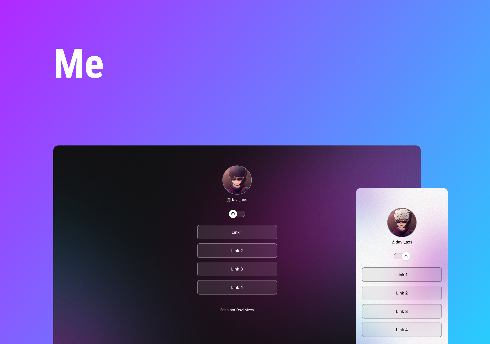

  <a href="#-tecnologias">Tecnologias</a>&nbsp;&nbsp;&nbsp;|&nbsp;&nbsp;&nbsp;
  <a href="#-projeto">Projeto</a>&nbsp;&nbsp;&nbsp;|&nbsp;&nbsp;&nbsp;
  <a href="#-layout">Layout</a>&nbsp;&nbsp;&nbsp;|&nbsp;&nbsp;&nbsp;

 

  

 

## 🚀 Tecnologias

Esse projeto foi desenvolvido com as seguintes tecnologias:

- [HTML]
- [CSS]
- [JavaScript]
- [Git e Github]
- [Figma]

## 💻 Projeto

O Me é um agregador de links para usar como cartão de visita online.

## 🔖 Layout

Nos links abaixo você encontra o layout do projeto. Lembrando que você precisa ter uma conta no [Figma](http://figma.com/) para acessá-lo.

- [Layout](https://www.figma.com/file/Do8iJwiRLSLERGXLW2HMji/DevLinks-(Community)?node-id=90%3A247&t=nX4Gth1lmzkIwVvx-0)

---

Feito por Davi Alves :wave:
